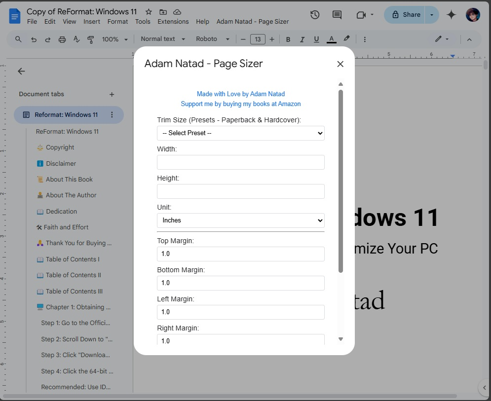

# Adam Natad - Custom Page Sizer

**Google Docs – Custom Page Sizer**

A lightweight Apps Script tool that adds a custom menu in Google Docs, allowing you to set your own page width, height, and margins — beyond the default options.

---

## ✨ Features

- Set **custom page size and margins**
- Adds a **dedicated menu**: `Adam Natad – Page Sizer`
- Fast and easy setup — no dependencies or installations needed

---

## 📁 Files Location

All scripts are located inside the [`AppScript`](./AppScript) folder:

- [`Code.gs`](./AppScript/Code.gs)  
- [`PageSizeDialog.html`](./AppScript/PageSizeDialog.html)

---

## 🚀 How to Install and Use

1. Open your **Google Doc**
2. Go to **Extensions** → **Apps Script**
3. Delete any default code
4. Add the following:
   - Create a **Script file** named `Code.gs`, then paste the contents from [`AppScript/Code.gs`](./AppScript/Code.gs)
   - Create an **HTML file** named `PageSizeDialog.html`, then paste the contents from [`AppScript/PageSizeDialog.html`](./AppScript/PageSizeDialog.html)
5. Save the project
6. Reload your Google Doc
7. You’ll see a custom menu called **`Adam Natad – Page Sizer`** appear in the top menu bar
8. Click **Set Page Size + Margins**
9. Enter your desired dimensions and margins, then hit **Apply**

---

## 📷 Preview

>   
> *“Adam Natad – Page Sizer” appears as its own menu at the top of your Google Doc.*

---

## 🎬 Watch It in Action

  
▶️ [Click here to watch the YouTube Short](https://www.youtube.com/shorts/tZn7T-6gJ6k)

---

**Made with love by Adam Natad**  
🌐 [natadtech.com](https://natadtech.com)  
📧 `adam@natadtech.com`

---

## 📄 License

This project is licensed under the MIT License. See the [LICENSE](./LICENSE) file for details.
