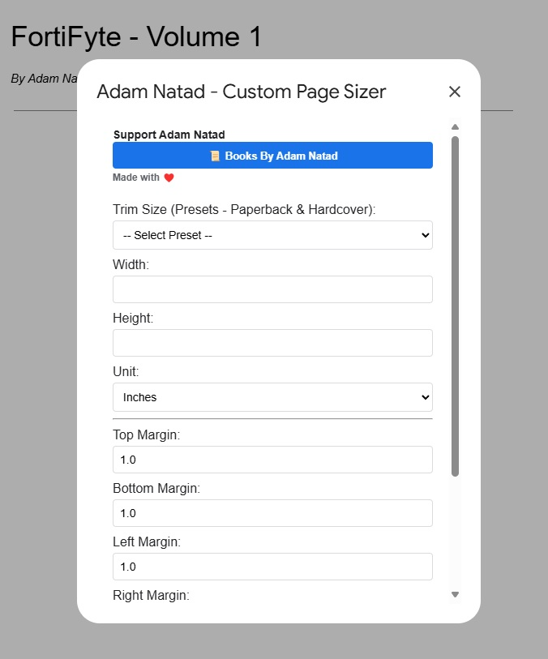
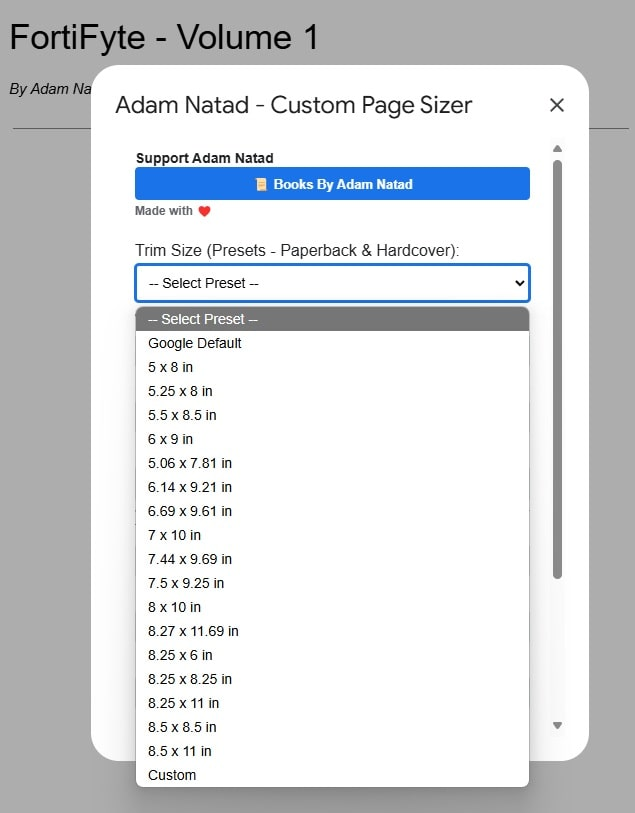
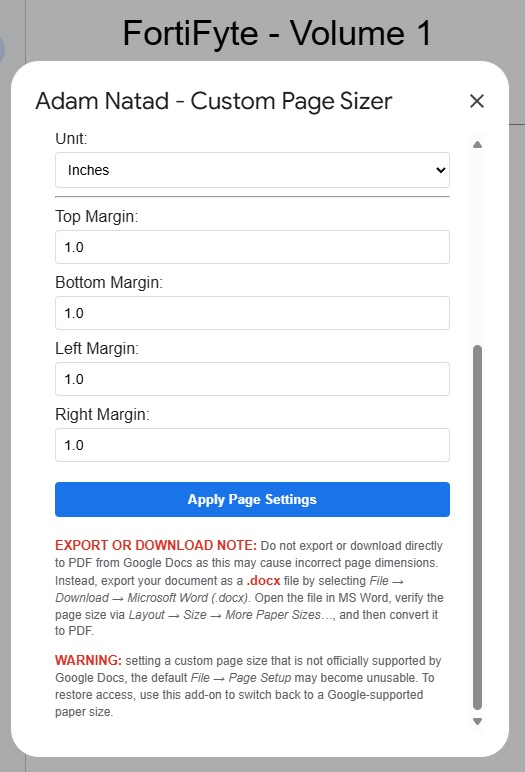
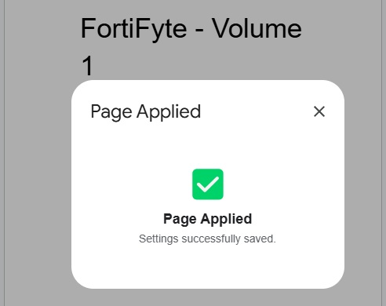
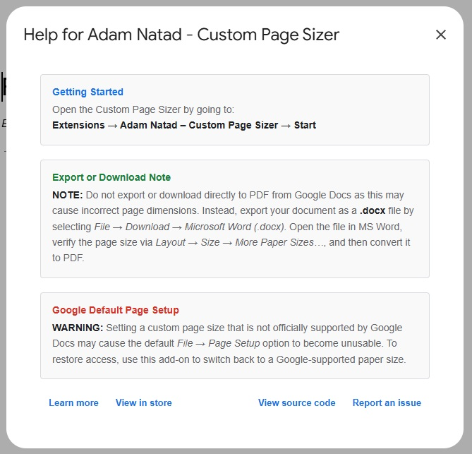

# Page Sizer by Adam Natad

**Custom Page Sizer for Google Docs**

Freely set custom page sizes and margins in Google Docs™. Perfect for Amazon KDP Paperback and Hardcover trim sizes. Made for authors who love writing in Google Docs™ like me. — Made with ♥️
  
A lightweight Apps Script tool that adds a custom menu inside Google Docs, allowing you to set your own page width, height, and margins beyond the default limitations.

Page Sizer by Adam Natad is a simple yet powerful Google Docs™ add-on that allows you to freely set custom page sizes and margins for your documents with ease. Whether you're preparing manuscripts for Amazon KDP Paperback or Hardcover formats, or simply want precise control over your document layout, this tool is built to support your writing needs.

⚙️ Features:
- Set exact page width and height (in inches or centimeters)
- Adjust top, bottom, left, and right margins
- Choose from preset trim sizes or define your own
- Designed with authors and self-publishers in mind

I created this for myself to streamline my publishing process, and I’m sharing it to help other writers and indie authors who love working in Google Docs™ as much as I do. No complicated setup, just install, customize, and write your story your way.

- Google Chat™ is a trademark of Google LLC

- NatadTech™ is a trademark of NatadTech Solutions OPC
---

## 🌐 Google Workspace Marketplace

Explore and install this tool directly from the Google Workspace Marketplace for a seamless experience.

### 👉 [Install The Add-On from The Google Workspace Marketplace](https://gsuite.google.com/marketplace/app/foo/207001493947)

---

## ✨ Features

- Set custom page size and margins  
- Adds a custom menu: **`Page Sizer by Adam Natad`**  
- Displays an animated success popup after applying changes  
- Provides a help dialog for first-time users  

---

## 📁 Files Location

All scripts are located inside the [`AppScript`](./AppScript) folder:

- [`Code.gs`](./AppScript/Code.gs)  
- [`PageSizeDialog.html`](./AppScript/PageSizeDialog.html)  
- [`SuccessDialog.html`](./AppScript/SuccessDialog.html)  
- [`HelpDialog.html`](./AppScript/HelpDialog.html)  

---

## 🚀 How to Install and Use

1. **Open your Google Doc.**  
2. Navigate to **Extensions** → **Apps Script**.
3. **Delete any existing code** in the script editor.
4. **Add the following files:**
   - Create a **Script file** named `Code.gs` and paste the contents from [`AppScript/Code.gs`](./AppScript/Code.gs)
   - Create an **HTML file** named `PageSizeDialog.html` and paste contents from [`AppScript/PageSizeDialog.html`](./AppScript/PageSizeDialog.html)
   - Create an **HTML file** named `SuccessDialog.html` and paste contents from [`AppScript/SuccessDialog.html`](./AppScript/SuccessDialog.html)
   - Create an **HTML file** named `GuideDialog.html` and paste contents from [`AppScript/GuideDialog.html`](./AppScript/GuideDialog.html)
   - Enable viewing of the manifest file:
     - Click the **gear icon ⚙️ (Project Settings)** in the left sidebar
     - Check **"Show 'appsscript.json' manifest file in editor"**
   - Open the newly visible `appsscript.json` file
   - Replace its contents with the JSON from [`AppScript/appsscript.json`](./AppScript/appsscript.json)
5. **Save** the project.
6. **Authorize the App:**
   - When you run the script for the first time (by selecting the custom menu), you will be prompted to grant authorization.
   - The app requires two OAuth scopes:
     - **`https://www.googleapis.com/auth/documents.currentonly`**  
       *This scope allows the app to modify only the currently open Google Doc, which is used for applying custom page sizes and margins.*
     - **`https://www.googleapis.com/auth/script.container.ui`**  
       *This scope enables the app to create and manage UI elements within Google Docs, such as the custom menu and dialogs.*
   - Follow the on-screen prompts and click **Allow** to grant these permissions.
7. **Reload your Google Doc.**
8. A new menu called **`Adam Natad – Custom Page Sizer`** will appear in your document.
9. **Select Start** from the menu to launch the page sizing tool.
10. Enter your custom dimensions and margins, then click **Apply**.

---

## 📷 Previews

Below are screenshots demonstrating various aspects of the tool. Each image is stored in the [`Previews`](./Previews) folder.

### Preview 1: Custom Menu  

*The custom menu "Page Sizer by Adam Natad" appears at the top of your Google Doc.*

### Preview 2: Page Size Dialog - Start Dialog  

*The main view of the page size dialog, where you can enter your custom dimensions and margins.*

### Preview 3: Select Preset Menu  

*An option to select a preset configuration for quick page setup.*

### Preview 4: Page Size Dialog - Start Dialog - Apply Page Settings  

*The bottom section of the page size dialog displaying the Apply Page Settings button.*

### Preview 5: Success Popup  

*An animated popup confirms your changes after applying the new page size.*

### Preview 6: Guide Dialog  

*A guide dialog provides guidance for first-time users on how to use the tool.*

---

## 🎬 Watch It in Action

### Quick Video - From App Script  
  
▶️ [Click here to watch the YouTube video "Quick Video - From App Script"](https://youtu.be/VHZyLZIrF1w)

### Quick Video - From Add-On Marketplace  
  
▶️ [Click here to watch the YouTube video "Quick Video - From Add-On Marketplace"](https://youtu.be/RWupNYfRYJ0)

### Detailed Video - From Add-On Marketplace  
  
▶️ [Click here to watch the YouTube video "Detailed Video - From Add-On Marketplace"](https://youtu.be/2tqSTqNpfjs)

---

**Made with love by Adam Natad**  
🌐 [natadtech.com](https://natadtech.com)  
📧 `adam@natadtech.com`

---

## 📄 License

This project is licensed under the MIT License. See the [LICENSE](./LICENSE) file for details.
