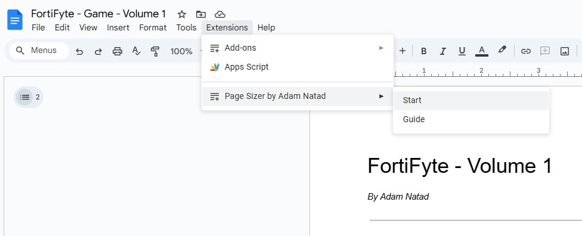

# Page Sizer by Adam Natad

**Custom Page Sizer for Google Docs™**

Freely set custom page sizes and margins in Google Docs™. Perfect for Amazon KDP Paperback and Hardcover trim sizes. Built for authors who love writing in Google Docs™. Made with ♥️

Page Sizer by Adam Natad is a lightweight Google Docs™ add-on (Apps Script) that adds a custom menu inside Google Docs, allowing you to set page **width**, **height**, and **margins** beyond the default limitations.

---

## 🌐 Google Workspace Marketplace

Install the add-on from the Google Workspace Marketplace:

👉 **Install Page Sizer (Marketplace):**  
https://workspace.google.com/marketplace/app/page_sizer_by_adam_natad/207001493947

Alternative listing link:  
https://gsuite.google.com/marketplace/app/foo/207001493947

---

## ⚙️ Features

- Set exact page width and height (in inches or centimeters)
- Adjust top, bottom, left, and right margins
- Choose from preset trim sizes or define your own
- Adds a custom menu: **`Page Sizer by Adam Natad`**
- Shows an animated success popup after applying changes
- Includes a guide dialog for first-time users
- Designed for authors and self-publishers (especially Amazon KDP)

---

## 📁 Files Location

All scripts are inside the [`AppScript`](./AppScript) folder:

- [`Code.gs`](./AppScript/Code.gs)
- [`PageSizeDialog.html`](./AppScript/PageSizeDialog.html)
- [`SuccessDialog.html`](./AppScript/SuccessDialog.html)
- [`GuideDialog.html`](./AppScript/GuideDialog.html)
- [`appsscript.json`](./AppScript/appsscript.json)

---

## 🚀 How to Install and Use (Manual Setup)

1. **Open your Google Doc**
2. Go to **Extensions → Apps Script**
3. **Delete any existing code** in the script editor
4. **Add the following files:**
   - Create a **Script** file named `Code.gs`, then paste from:  
     [`AppScript/Code.gs`](./AppScript/Code.gs)
   - Create an **HTML** file named `PageSizeDialog.html`, then paste from:  
     [`AppScript/PageSizeDialog.html`](./AppScript/PageSizeDialog.html)
   - Create an **HTML** file named `SuccessDialog.html`, then paste from:  
     [`AppScript/SuccessDialog.html`](./AppScript/SuccessDialog.html)
   - Create an **HTML** file named `GuideDialog.html`, then paste from:  
     [`AppScript/GuideDialog.html`](./AppScript/GuideDialog.html)
5. **Enable the manifest file (`appsscript.json`):**
   - Click **⚙️ Project Settings**
   - Enable **Show "appsscript.json" manifest file in editor**
   - Open `appsscript.json` and replace its contents with:  
     [`AppScript/appsscript.json`](./AppScript/appsscript.json)
6. **Save** the project
7. **Authorize the app** when prompted:
   - The first time you run it (via the custom menu), Google will ask for authorization
8. **Reload** your Google Doc
9. You will see a new menu called **`Page Sizer by Adam Natad`**
10. Click **Start**, enter your custom size and margins, then click **Apply**

---

## 🔐 Permissions (OAuth Scopes)

When first used, Google will ask for authorization. The add-on uses:

- **`https://www.googleapis.com/auth/documents.currentonly`**  
  Allows the add-on to modify **only the currently open Google Doc** (needed to apply custom page sizes and margins).

- **`https://www.googleapis.com/auth/script.container.ui`**  
  Allows the add-on to create UI inside Google Docs (custom menu + dialogs).

---

## 📷 Previews

All images are stored in the [`Previews`](./Previews) folder.

### Preview 1: Custom Menu

*The custom menu "Page Sizer by Adam Natad" appears at the top of your Google Doc.*

### Preview 2: Page Size Dialog (Start)

*The main dialog where you enter custom dimensions and margins.*

### Preview 3: Preset Selector

*Quickly choose a preset trim size configuration.*

### Preview 4: Apply Page Settings Button

*The section containing the Apply button.*

### Preview 5: Success Popup

*Animated popup confirming your changes were applied.*

### Preview 6: Guide Dialog

*A first-time guide dialog showing how to use the tool.*

---

## 🎬 Watch It in Action

All videos are hosted on [YouTube - Adam Natad](https://youtube.com/@AdamNatad)

### ▶️ [Quick Video (Apps Script)](https://youtu.be/VHZyLZIrF1w)
  

---

### ▶️ [Quick Video (Add-On Marketplace)](https://youtu.be/RWupNYfRYJ0)
  

---

### ▶️ [Detailed Video (Add-On Marketplace)](https://youtu.be/2tqSTqNpfjs)
  

---

## 🧾 Notes

- Google Docs™ is a trademark of Google LLC
- NatadTech™ is a trademark of NatadTech Solutions OPC

---

## 📬 Contact

**Made with love by Adam Natad**  
🌐 https://natadtech.com  
📧 adam@natadtech.com

---

## 📄 License

This project is licensed under the MIT License. See the [LICENSE](./LICENSE) file for details.
